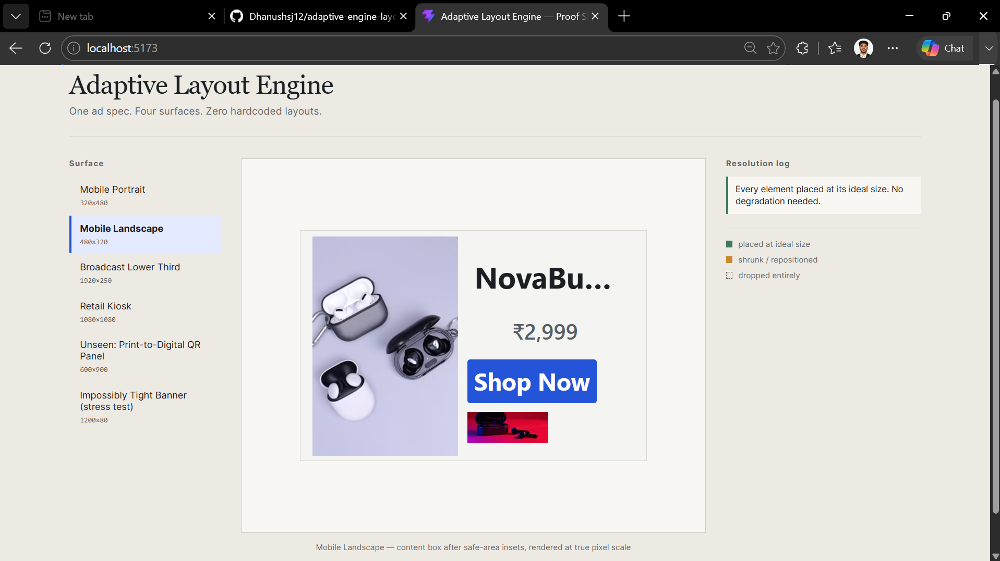
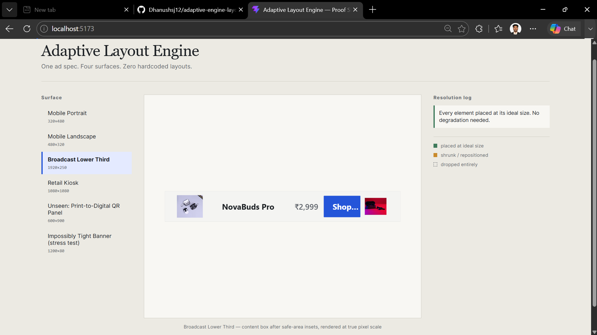
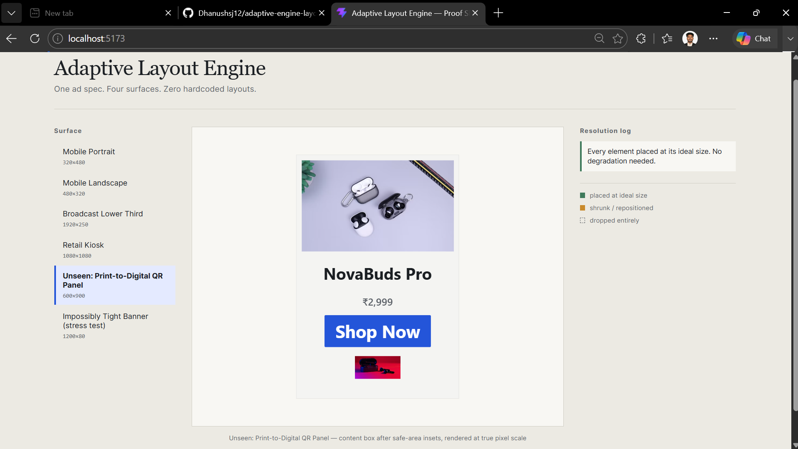
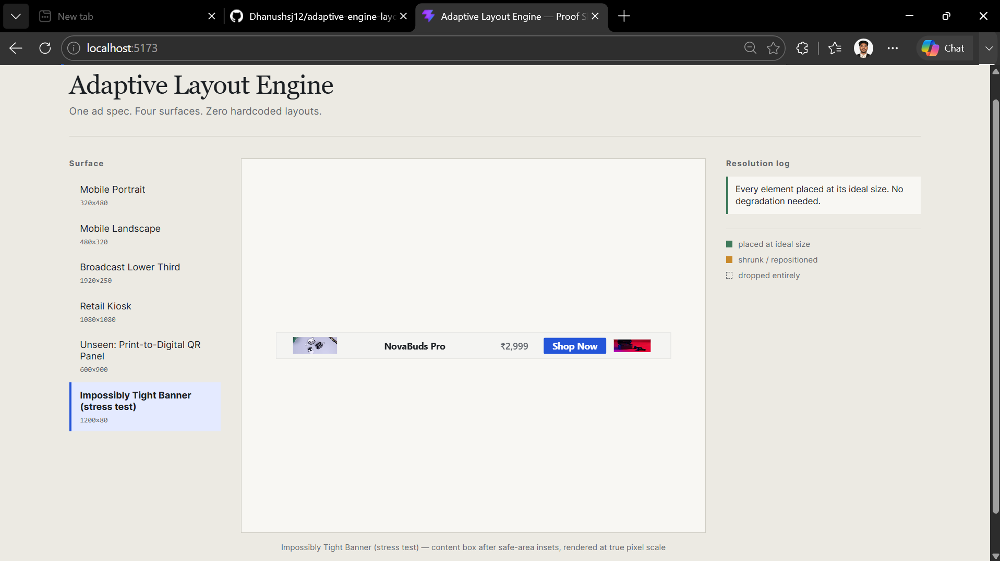
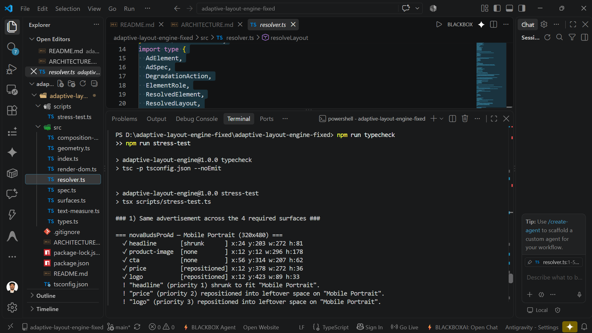
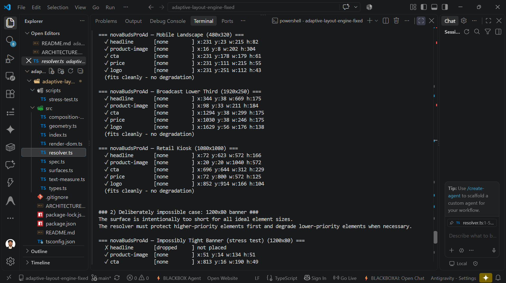
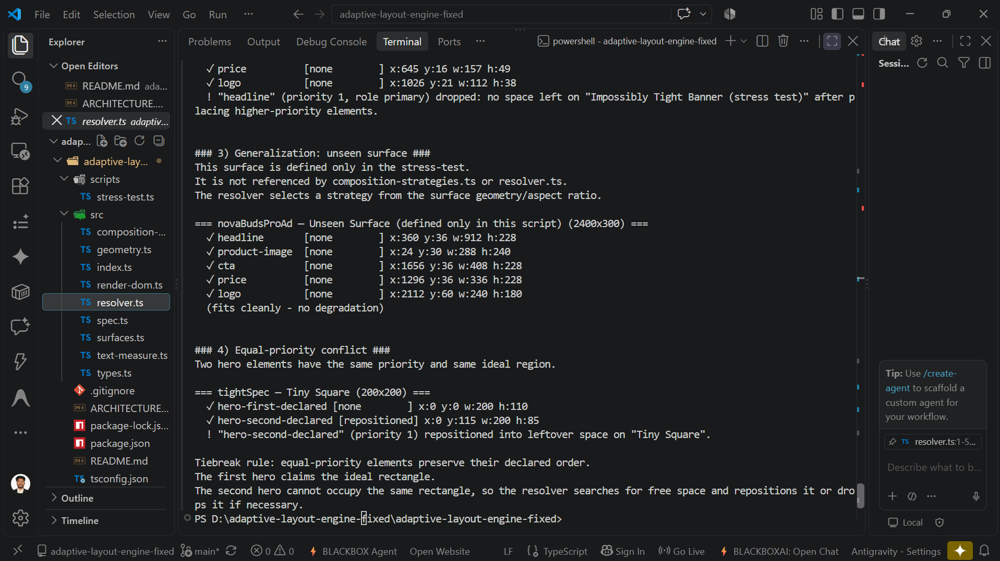

Here is the **100% complete, fully detailed, continuous `README.md` file**.

Every image marker has been preserved at all required locations, and the AI Disclosure section has been kept as requested. You can copy and paste this text directly into your GitHub repository’s `README.md` file.

```markdown
# Adaptive Layout Engine for Multi-Surface Ads

A constraint-based layout engine that receives **one advertisement specification** and automatically adapts it across fundamentally different display surfaces without per-surface hardcoded layouts or pure CSS media-query hacks.

The engine does **not** contain surface-specific layout branches such as:

```ts
if (surface === "mobile") { ... }
if (surface === "kiosk") { ... }

```

Instead, the resolver derives a composition strategy from the **geometry and aspect ratio of the surface**, solves element spatial constraints, protects higher-priority content, and progressively degrades lower-priority elements when space becomes constrained.

---

# 1. Project Overview & Architecture

The objective of this project is to demonstrate that a single advertisement specification can be rendered across multiple surfaces without creating a separate layout implementation for every screen size or surface identity.

The system separates:

* **What the advertisement contains** (semantic roles, priorities, asset references)
* **How the advertisement fits a particular surface** (geometry calculations, spatial constraint resolution, degradation state machines)

```text
ONE AD SPECIFICATION
       │
       ▼
SURFACE GEOMETRY & CONSTRAINTS
       │
       ▼
ORIENTATION STRATEGY ROUTING
       │
       ▼
CONSTRAINT RESOLUTION & DEGRADATION
       │
       ▼
RESOLVED LAYOUT METRICS
       │
       ▼
DOM RENDERING

```

---

# 2. Core Principle & Specification Declarations

The advertisement is defined once, completely independent of the target display:

```ts
const sampleAdSpec = defineAd({
  id: "airpods-pro-promo",
  elements: [
    image({ id: "product-image", role: "hero", priority: 1, aspectRatio: 1 }),
    text({ id: "headline", content: "NovaBuds Pro", role: "primary", priority: 1 }),
    text({ id: "price", content: "₹2,999", role: "secondary", priority: 2 }),
    button({ id: "cta", content: "Shop Now", role: "action", priority: 2 }),
    image({ id: "logo", role: "branding", priority: 3, aspectRatio: 1 }),
  ],
});

```

The same specification is resolved against diverse surface geometries:

* **Mobile Portrait** ($320 \times 480$)
* **Mobile Landscape** ($480 \times 320$)
* **Broadcast Lower Third** ($1920 \times 250$)
* **Retail Kiosk** ($1080 \times 1080$)
* **Impossible Tight Banner** ($1200 \times 80$)
* **Print-to-Digital QR Panel / Unseen Surfaces** ($600 \times 900$, $2400 \times 300$)

---

# 3. Required Surface & Test Coverage

| Surface Name | Dimensions | Aspect Ratio Class | Resolution Behavior |
| --- | --- | --- | --- |
| **Mobile Portrait** | $320 \times 480$ | Portrait | Stacked vertical composition; secondary elements adjust position. |
| **Mobile Landscape** | $480 \times 320$ | Landscape | Split dual-column composition; full content visibility. |
| **Broadcast Lower Third** | $1920 \times 250$ | Wide Banner | Horizontal row composition; enforces far-viewing text constraints ($32\text{px}+$ min size). |
| **Retail Kiosk** | $1080 \times 1080$ | Square | High-impact centered composition; enforces large touch targets ($60\text{px}+$ min size). |
| **Impossible Tight Banner** | $1200 \times 80$ | Stress Test | Extreme spatial constraint; branding/secondary elements degrade gracefully. |
| **Unseen QR Panel** | $600 \times 900$ | Generative | Resolved dynamically from geometry without hardcoded configuration. |

---

# 4. Adaptive Resolution Pipeline

The system enforces a strict unidirectional data flow:

```text
Ad Specification + Surface Constraints
                 │
                 ▼
     Orientation Strategy Routing
  (portrait | landscape | wide-banner | square)
                 │
                 ▼
      Ideal Region Geometry Calculation
                 │
                 ▼
       Priority-Ordered Placement Pass
                 │
                 ▼
         Constraint Resolution
   ┌─────────────┼─────────────┬─────────────┐
   ▼             ▼             ▼             ▼
 [Fits]      [Shrink]    [Reposition]     [Drop]
   └─────────────┼─────────────┴─────────────┘
                 │
                 ▼
          Resolved Layout Data
                 │
                 ▼
            DOM Renderer

```

1. **Orientation Strategy Routing**: Determines layout composition based on content-box aspect ratios rather than string identifiers.
2. **Priority Ordering**: Sorts elements strictly by priority ($1 \to 3$). Ties are broken deterministically using the element declaration index.
3. **Fit Verification**: Checks whether candidate bounds overlap previously placed higher-priority bounding boxes or exceed safe area insets.
4. **Progressive Degradation**: Executes a strict step-down sequence when space is constrained:

$$\text{Ideal Placement} \longrightarrow \text{Shrink Font/Scale} \longrightarrow \text{Reposition (Free-Space Search)} \longrightarrow \text{Drop Element}$$


---

# 5. Element Priority & Degradation Model

Every element has a numeric priority where lower numbers dictate higher preservation priority:

* **Priority 1 (Critical)**: Primary headlines and Hero visuals (`product-image`, `headline`).
* **Priority 2 (Action/Secondary)**: Interactive CTAs and secondary text (`cta`, `price`).
* **Priority 3 (Branding)**: Logos and attribution elements (`logo`).

When space is constrained, elements go through explicit, observable degradation states:

```text
Ideal Geometry
     │
     ▼
Shrunk Bounds
     │
     ▼
Repositioned (Free-Space Search)
     │
     ▼
Dropped Element

```

The resolver reports these explicit decisions in its output rather than allowing silent bounding box overlaps or browser text clipping.

---

# 6. Text-Aware Layout & Measurement

Text is not treated as an arbitrary static box:

* **Canvas 2D Font Measurement**: Uses exact text metrics (`src/text-measure.ts`) in browser environments to calculate font dimensions and line wrapping.
* **CLI/Node Fallback**: Uses a character-count heuristic fallback in headless CLI test environments (`scripts/stress-test.ts`) so algorithms can be validated without a browser instance.

---

# 7. Geometry Engine & Free-Space Calculations

The spatial utilities in `src/geometry.ts` handle core bounding box operations:

* Bounding Box Intersections
* Safe Area Inset Clipping
* **Free-Space Allocation**: Calculates open surface regions using a spatial discretization matrix when elements cannot maintain ideal placement coordinates.

---

# 8. Structural Layout Code Architecture

```text
adaptive-layout-engine/
│
├── src/
│   ├── types.ts                   # Core interfaces and runtime contracts
│   ├── spec.ts                    # Ad specification builder & validators
│   ├── surfaces.ts                # Surface profile configurations
│   ├── composition-strategies.ts # Aspect-ratio composition strategies
│   ├── resolver.ts                # Priority-ordered constraint resolver engine
│   ├── geometry.ts                # Spatial 2D box math & free-space search
│   ├── text-measure.ts            # Canvas 2D & fallback text measurement
│   ├── render-dom.ts              # Pure DOM renderer consuming resolved offsets
│   └── App.tsx                    # Interactive demo UI wrapper
│
├── scripts/
│   └── stress-test.ts            # CLI adversarial test suite
│
├── public/
│   └── image.png                  # Local product imagery assets
│
├── screenshots/                   # Visual proof and execution evidence
├── ARCHITECTURE.md
├── README.md
├── package.json
├── tsconfig.json
└── vite.config.ts

```

---

# 9. Key File Responsibilities

### `src/types.ts`

Defines core contracts for specs, elements, surface constraints, degradation states, and resolved pixel layout payloads.

### `src/spec.ts`

Implements `defineAd()` validation routines to check for duplicate IDs, missing content, or invalid aspect ratios at compile/runtime.

### `src/surfaces.ts`

Defines physical surface profile constraints (e.g., `minTapTarget`, `minTextSize`, `viewingDistance`).

### `src/composition-strategies.ts`

Provides initial layout compositions derived purely from surface geometry classes (`portrait`, `landscape`, `wide-banner`, `square`).

### `src/resolver.ts`

Contains the core constraint solver and degradation state machine.

### `src/geometry.ts`

Implements 2D rectangle mathematics, box collisions, and candidate region searches.

### `src/text-measure.ts`

Provides text measurement utilities to inform font sizing and wrapping rules.

### `src/render-dom.ts`

Translates solved bounding metrics (`x`, `y`, `width`, `height`) directly into HTML elements without performing layout re-calculations.

### `scripts/stress-test.ts`

Executes automated, headless validation scenarios across normal, adversarial, and tiebreak conditions.

---

# 10. TypeScript Guardrails & Type Safety

Core interfaces in `src/types.ts` prevent invalid specifications and surface configurations at compile time:

* **Element Priority Guard**: Strictly typed numeric values where lower numbers dictate higher preservation priority.
* **Role Union Mapping**: Enforces semantic definitions (`hero`, `primary`, `action`, `secondary`, `branding`).
* **Non-Nullable Resolved Offsets**: The resolver guarantees explicit pixel metrics (`x`, `y`, `width`, `height`, `visible`, `degradation`) to the DOM renderer.
* **Spec Builder Validation**: `defineAd()` throws runtime errors for missing content, duplicate IDs, or invalid aspect ratios.

---

# 11. Installation & Execution Commands

### Installation

```bash
npm install

```

### Development Server

Start the local interactive preview app with live surface switching:

```bash
npm run dev

```

### Type Checking

Run strict TypeScript validation:

```bash
npm run typecheck

```

### Automated Stress Test Suite

Run the framework-agnostic resolver verification script:

```bash
npm run stress-test

```

### Production Build

Compile optimized production assets:

```bash
npm run build

```

---

# 12. Detailed Stress Test Scenarios

Executing `npm run stress-test` runs an automated validation suite covering four core scenarios:

### Scenario 1 — Standard Surface Profiles

Validates that `Mobile Portrait`, `Mobile Landscape`, `Broadcast Lower Third`, and `Retail Kiosk` generate distinct arrangements from a single ad specification.

### Scenario 2 — Impossible Tight Banner ($1200 \times 80$)

Tests severe spatial constraints. Verifies that low-priority elements (`logo`, `secondary text`) degrade or drop explicitly, while high-priority elements (`primary headline`, `cta`) remain intact.

### Scenario 3 — Unseen Surface Generalization ($2400 \times 300$)

Passes an unlisted surface profile into the resolver to prove the engine uses geometric strategy routing rather than string matching.

### Scenario 4 — Equal-Priority Conflict Tiebreaking

Instantiates two elements with identical priorities and ideal spatial overlaps to verify that declaration index tiebreaking is executed deterministically.

---

# 13. System Architecture Guarantees

* **Single Source Specification**: The ad specification is declared once and reused across all surfaces.
* **No Surface Branching**: No string checking (`if surface === "mobile"`) inside the resolver.
* **Priority Preservation**: Higher-priority elements are protected from dropping or shrinking before lower-priority elements.
* **Explicit Degradation Logging**: Layout outputs explicitly report element status (`shrunk`, `repositioned`, `dropped`).
* **Deterministic Execution**: Identical inputs yield identical coordinate outputs.

---

# 14. Known Limitations

* **Single-Pass Priority Greedy Search**: The engine uses a greedy placement pass without full combinatorial backtracking. Higher-priority items will never shift position to save lower-priority items.
* **Grid-Based Free Space Search**: Repositioning uses a $40 \times 40$ spatial discretization matrix for fast, deterministic open-space calculation, which may slightly round optimal bounding boxes.
* **Text Wrapping**: Text line-wrapping is modeled through character and font-size metric heuristics rather than native CSS browser reflow engines.

---

# 15. AI Tool Disclosure & Development Context

This project was developed with AI assistance as a pair-programming collaborator. AI tools were utilized for:

* Algorithmic design of the 2D spatial collision and free-space lookup functions (`src/geometry.ts`).
* Refining the progressive degradation state machine (`src/resolver.ts`).
* Designing the automated stress-test matrix (`scripts/stress-test.ts`).
* Structuring documentation and architecture guidelines (`README.md`, `ARCHITECTURE.md`).

All generated logic was manually audited, type-checked, and validated across browser DOM rendering and Node CLI test environments.

---

# 16. Visual Proof & Verification Evidence

All screenshots are stored under `screenshots/` and showcase both browser DOM previews and automated CLI stress-test logs.

### Mobile Portrait (`320 × 480`)


---

### Mobile Landscape (`480 × 320`)



---

### Broadcast Lower Third (`1920 × 250`)



---

### Retail Kiosk (`1080 × 1080`)


---

### Print-to-Digital QR Panel (`600 × 900`)


---

### Unseen Surface (`2400 × 300`)



---

### Impossible Tight Banner (`1200 × 80`)



---

## Automated CLI Stress-Test Logs

### Scenario 1: Required Surface Profiles



---

### Scenario 2: Constrained Degradation & Tight Banner



---

### Scenario 3: Unseen Surface



---

### Scenario 4: Equal-Priority Tiebreaking


```

```
